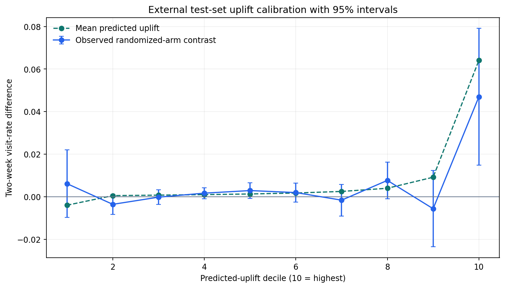
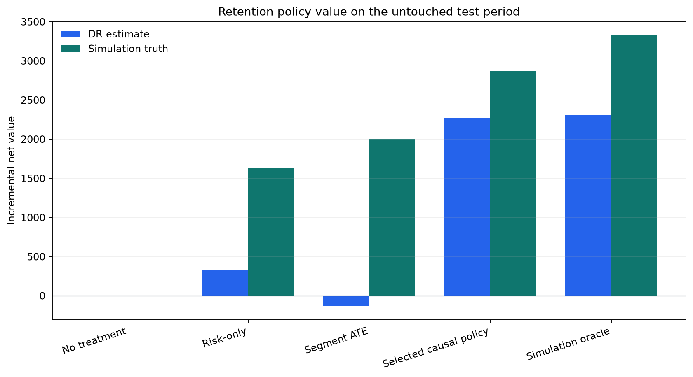
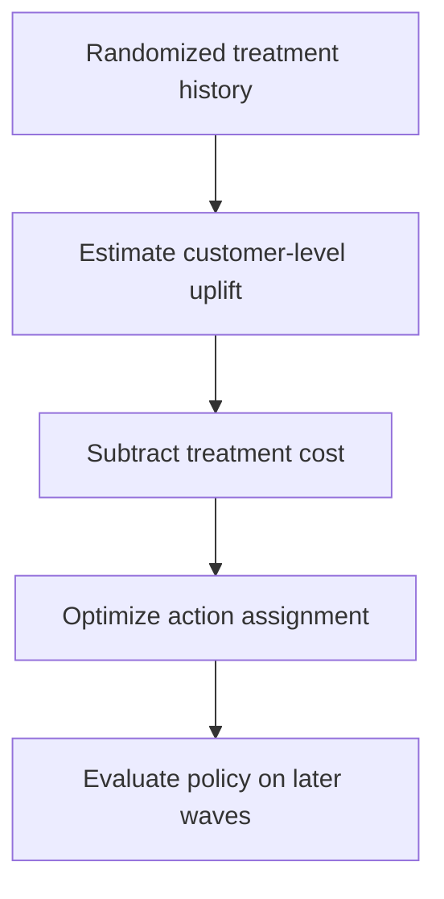
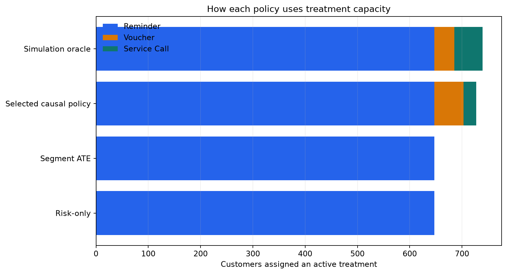
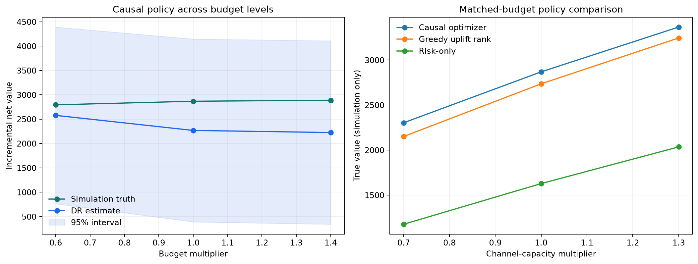
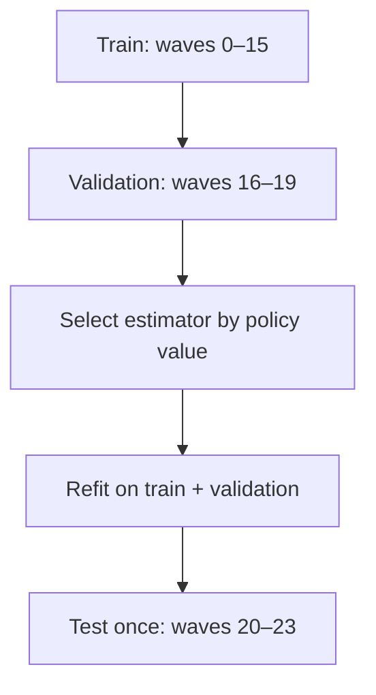
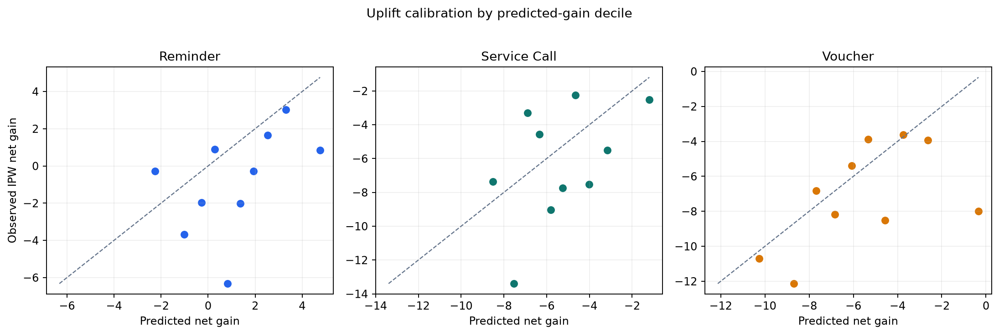
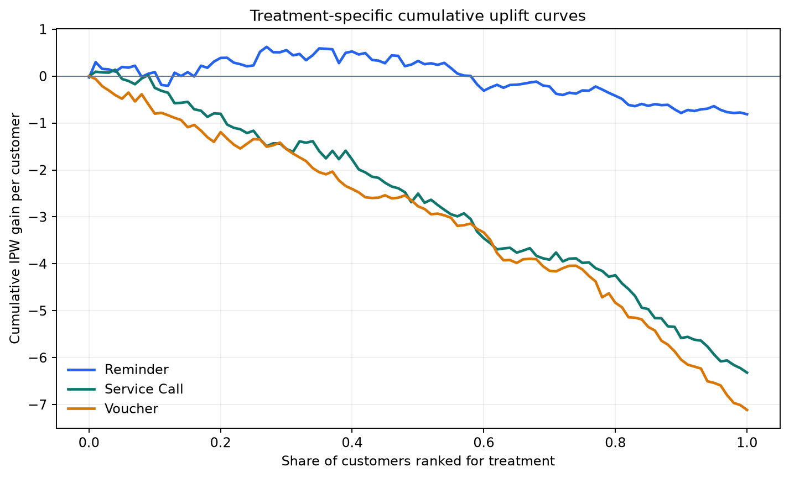

# Retention Treatment Uplift & Policy Optimization

[](https://github.com/parisaMSTFV/retention-treatment-uplift/actions/workflows/ci.yml)
[](https://www.python.org/)
[](DATA_PROVENANCE.md)

A churn score estimates who may leave. This project asks the next decision question: **which
customers should receive a retention action, which action should they receive, and will the
incremental value justify its cost?** It learns heterogeneous effects from a randomized
experiment and turns them into a budget- and capacity-constrained policy.

> The multi-action retention decision run is synthetic. A separate external validation uses the
> public, anonymized CRITEO-UPLIFTv2.1 randomized advertising benchmark. No employer data, schema,
> code, business rule, or internal threshold is used; no Criteo row-level data is committed.

## External evidence card

| Evidence layer | Executed result |
|---|---|
| **Source identity** | Full 13,979,592-row CRITEO-UPLIFTv2.1 file verified at 311,422,618 bytes and SHA-256 `2716e1bf…f616dc`. |
| **Design** | Advertising incrementality tests with randomized assignment/holdout; estimand is assignment ITT on two-week visits in the released benchmark. |
| **Frozen test** | T-learner logistic selected and thresholded on validation, then evaluated once on 59,779 independent test rows. |
| **Uncertainty** | Top-score policy reached 30.3%; AIPW visit effect among targeted rows was **1.403%** (95% CI **0.279% to 2.528%**). |
| **Matched reach** | Increment over random targeting at the same reach was **0.297% per eligible row** (95% CI **0.054% to 0.540%**). |
| **Randomization audit** | Treatment-prediction AUC **0.5005**; maximum absolute feature SMD **0.0419**. |

This is real external evidence for the repository's **binary uplift mechanics**, not validation of
retention economics, multi-action choice, treatment costs, or transportability. The released file
is non-uniformly subsampled, has no time/experiment identifier, and is licensed
[CC BY-NC-SA 4.0](https://creativecommons.org/licenses/by-nc-sa/4.0/) for noncommercial use.
See the [external run summary](reports/external_validation/run_summary.md),
[source provenance](reports/external_validation/source_provenance.json), and
[validation contract](docs/criteo_external_validation.md).



## Decision card

| Decision layer | Executed synthetic evidence |
|---|---|
| **Who** | 727 of 2,943 test customers receive an active treatment after value and operating constraints are applied; 2,216 receive no treatment. |
| **Which action** | 647 reminders, 56 vouchers, and 24 service calls. |
| **Net value** | Doubly robust estimate: **2,270** with a **95% CI of 392 to 4,148**; simulation truth: **2,870**, or **76.2% above risk-only targeting**. |

The interval is positive but wide, so the estimate does not support automatic deployment. The
candidate policy requires a prospective randomized test with the same cost and capacity rules.



## Quick start

```bash
python -m pip install -e ".[dev]"
retention-uplift --project-root local-runs/latest
make check
```

The run regenerates the synthetic experiment, policy outputs, diagnostics, and figures under
the ignored `local-runs/latest` directory. Row-level data and hidden potential outcomes remain
excluded from Git.

### Reproduce the external validation

Review Criteo's noncommercial ShareAlike license, then explicitly accept it for the download:

```bash
python scripts/download_criteo_uplift.py \
  --accept-license CC-BY-NC-SA-4.0

retention-uplift \
  --external-criteo data/external/criteo-research-uplift-v2.1.csv.gz \
  --external-sample-size 300000 \
  --external-target-share 0.30 \
  --seed 42 \
  --project-root local-runs/criteo
```

The command verifies the exact official checksum and row count, validates the complete source,
and writes aggregate evidence only. The raw file and deterministic modeling sample stay ignored.

## Business question

A churn score identifies customers who may leave, but it does not reveal whether an intervention
will change their behavior. This project answers a different set of questions:

1. Which customers have a positive incremental response to a reminder, voucher, or service call?
2. Which one of those treatments creates the highest expected value after treatment cost?
3. Who should be contacted when budget and channel capacity are limited?

## Decision flow



The four randomized arms are `Control`, `Reminder`, `Voucher`, and `Service call`. Each customer
can receive at most one active treatment. The optimizer may also choose control when every
predicted treatment gain is negative.

## Evaluation detail

The committed run uses seed `42`, 18,000 synthetic customers, 24 experiment waves, and a final
four-wave test period that is not used for model selection.

| Untouched test measure | Result |
|---|---:|
| Selected estimator | T-learner linear |
| Regret versus simulation oracle | **13.9%** |
| Treatment budget used | 1,027.5 of 1,030.05 |
| Minimum randomized-arm propensity | **0.15** |
| Budget/capacity scenarios passing constraints | **9 of 9** |

The true value and oracle are visible only because the data generator retains hidden expected
potential outcomes. They are never used to select the model or build the deployable policy.

## Why a simpler model won

The pipeline compares:

- a linear T-learner with one outcome model per randomized arm;
- a nonlinear histogram-gradient-boosting T-learner;
- a cross-fitted DR-learner with doubly robust pseudo-outcomes.

The primary selection metric is doubly robust policy value on the chronological validation
period. The linear T-learner won that pre-defined comparison. Complexity was not rewarded when
it did not improve the decision metric.

| Validation model | DR policy value | 95% interval | Selected |
|---|---:|---:|:---:|
| T-learner linear | 3,911 | 2,135 to 5,688 | Yes |
| DR-learner hist | 2,997 | 854 to 5,141 | No |
| T-learner hist | 2,829 | 717 to 4,940 | No |

## From uplift scores to an operating policy

For customer \(i\) and treatment \(a\), the decision score is:

\[
\widehat{G}_{i,a} =
\widehat{E}[Y_i(a) - Y_i(0) \mid X_i] - Cost(a)
\]

The mixed-integer program maximizes total predicted net gain subject to:

- at most one active action per customer;
- a shared treatment budget ceiling;
- separate capacity ceilings for reminders, vouchers, and service calls;
- no requirement to spend budget on a negative predicted gain.

The selected test policy assigns 647 reminders, 56 vouchers, and 24 service calls. Risk-only and
segment-average baselines use reminders alone because they cannot separate individual treatment
response as precisely.



## Overlap and operating sensitivity

Because assignment is randomized with known probabilities, the overlap audit uses the experiment
design rather than fitting an unnecessary observational propensity model. Every customer is
eligible for all four arms. Across train, validation, and test, the smallest configured propensity
is 0.15, the largest inverse-probability weight is 6.67, and every arm passes the pre-declared 5%
support rule. No synthetic observations are trimmed.

The policy is then re-optimized on a 3-by-3 grid of budget and channel-capacity multipliers. Each
point compares the causal optimizer, risk-only targeting, and a greedy uplift-ranked heuristic
under identical constraints—27 policy evaluations in total, all passing their ceilings.

| Test operating point | Causal optimizer true value | Decision interpretation |
|---|---:|---|
| 0.6x budget, 1.0x capacity | 2,796 | Retains 97.4% of base value with 60% of the budget ceiling |
| 1.0x budget, 1.0x capacity | 2,870 | Base operating policy |
| 1.0x budget, 0.7x capacity | 2,304 | Channel scarcity removes 19.7% of base value |
| 1.0x budget, 1.3x capacity | 3,367 | Extra channel capacity adds 17.3% over base |

The grid indicates that channel capacity is more binding than budget in this synthetic run. DR
intervals remain wide, so these comparisons motivate a prospective operating test; they do not
justify automatic deployment or claim monotonic realized value.



## Evaluation design



- Experiment health checks include arm counts and standardized mean differences.
- Design-based overlap diagnostics report arm propensities, IPW exposure, support rules, and
  trimming decisions.
- Policy value is estimated with a doubly robust off-policy estimator.
- Treatment ranking uses IPW cumulative gain, AUUC, and Qini.
- Uplift calibration compares predicted and observed IPW gain by decile.
- Synthetic-only diagnostics report effect RMSE, rank correlation, and regret versus the oracle.
- A leakage test changes outcomes and hidden future truth and confirms model features do not move.
- Policy sensitivity compares three policies on matched budget and capacity constraints.





## Repository structure

```text
src/retention_uplift/   simulation plus isolated Criteo adapter and external validation
tests/                  randomization, leakage, contract, checksum, policy, and pipeline tests
docs/                   external-data contract, analysis plan, metrics, model card, interview guide
reports/                synthetic decision run plus aggregate external-validation evidence
scripts/                verified external downloader and public-file sensitive-content check
.github/workflows/      CI on Python 3.11 and 3.12
```

The row-level synthetic experiment and hidden potential outcomes are regenerated locally and
excluded from Git. Only a 30-row synthetic policy sample and aggregate outputs are committed.

## Environment setup

The Quick Start assumes Python 3.11 or later. To isolate the dependencies first:

```bash
python -m venv .venv
source .venv/bin/activate
```

On Windows PowerShell:

```powershell
.venv\Scripts\Activate.ps1
```

Then run the Quick Start commands above. On Windows without `make`, use `python -m ruff check .`,
`python -m unittest discover -s tests -v`, and `python scripts/check_sensitive.py`.

## Documentation

- [Analysis plan](docs/analysis_plan.md)
- [Metric dictionary](docs/metric_dictionary.md)
- [Model card](docs/model_card.md)
- [Interview guide](docs/interview_guide.md)
- [Data provenance](DATA_PROVENANCE.md)
- [Criteo external-validation contract](docs/criteo_external_validation.md)
- [External run summary](reports/external_validation/run_summary.md)
- [External source provenance](reports/external_validation/source_provenance.json)
- [Reproducible run summary](reports/run_summary.md)
- [Decision note](reports/decision_note.md)
- [Policy comparison](reports/policy_comparison.csv)
- [Overlap diagnostics](reports/overlap_diagnostics.csv)
- [Policy sensitivity grid](reports/policy_sensitivity.csv)
- [Synthetic policy sample](reports/policy_assignments_sample.csv)

## Limitations

- Synthetic effects validate the workflow but do not predict real customer response.
- The external benchmark covers one binary advertising assignment and two-week outcomes; it does
  not validate retention actions, economics, capacity constraints, or temporal transportability.
- Criteo experiment strata and their assignment probabilities are not in the public schema; the
  external AIPW report therefore uses and discloses the pooled training assignment share.
- Randomization probabilities are known and stable; production experiments may have
  non-compliance, missing exposures, and delayed outcomes.
- The policy optimizes a 60-day net-value outcome and does not capture longer-term habituation,
  channel fatigue, spillovers, or strategic customer experience costs.
- Decile-level calibration remains noisy for the smaller treatment arms.
- Production use requires prospective testing, eligibility and consent rules, cost
  reconciliation, fairness review, drift monitoring, and a persistent holdout.

## License

MIT
