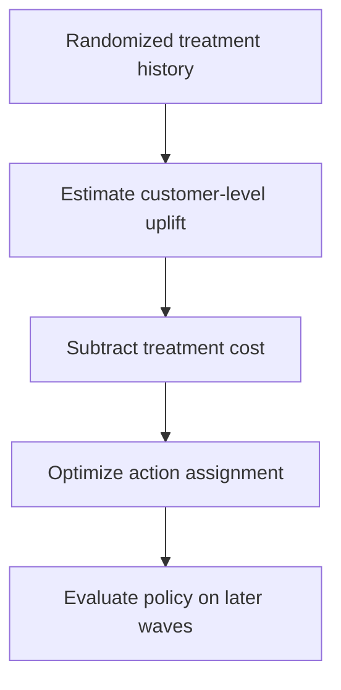
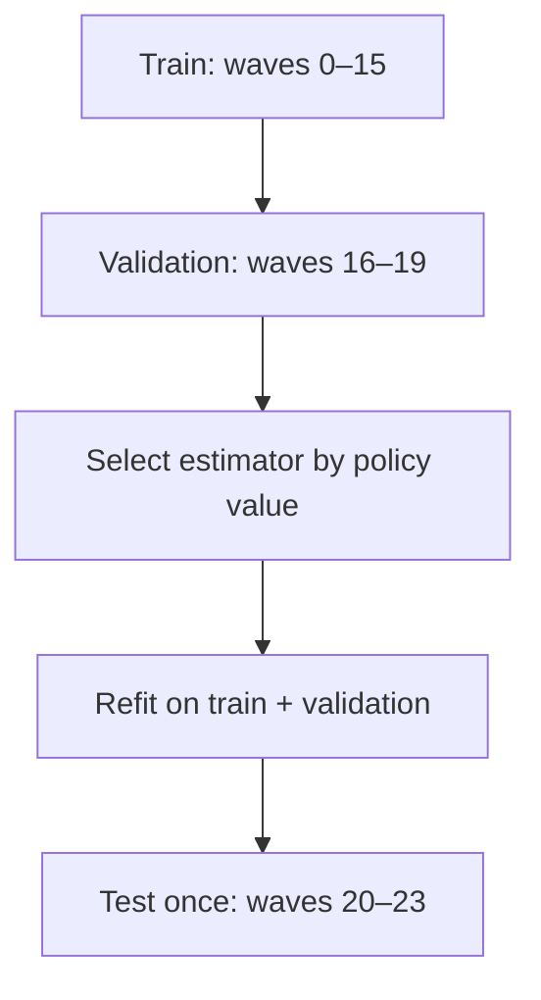

# Retention Treatment Uplift & Policy Optimization

[](https://github.com/parisaMSTFV/retention-treatment-uplift/actions/workflows/ci.yml)
[](https://www.python.org/)
[](DATA_PROVENANCE.md)

A reproducible causal machine-learning case study for deciding **who should receive a retention
intervention and which intervention creates the highest incremental net value**. The project
learns heterogeneous effects from a randomized experiment, compares three uplift estimators,
and turns predicted gains into a budget- and capacity-constrained customer policy.

> Every customer, feature, experiment wave, treatment, cost, constraint, and result is synthetic.
> No employer data, schema, code, business rule, or internal threshold is used.

## Business question

A churn score identifies customers who may leave, but it does not reveal whether an intervention
will change their behavior. This project answers a different set of questions:

1. Which customers have a positive incremental response to a reminder, voucher, or service call?
2. Which one of those treatments creates the highest expected value after treatment cost?
3. Who should be contacted when budget and channel capacity are limited?

## Decision flow



The four randomized arms are `Control`, `Reminder`, `Voucher`, and `Service call`. Each customer
can receive at most one active treatment. The optimizer may also choose control when every
predicted treatment gain is negative.

## Validated result

The committed run uses seed `42`, 18,000 synthetic customers, 24 experiment waves, and a final
four-wave test period that is not used for model selection.

| Untouched test measure | Result |
|---|---:|
| Selected estimator | T-learner linear |
| Customers in test | 2,943 |
| True incremental net value in simulation | **2,870** |
| Doubly robust policy estimate | **2,291** |
| 95% confidence interval | **405 to 4,177** |
| Improvement over risk-only targeting | **76.2%** |
| Regret versus simulation oracle | **13.9%** |
| Treatment budget used | 1,027.5 of 1,030.05 |

The true value and oracle are visible only because the data generator retains hidden expected
potential outcomes. They are never used to select the model or build the deployable policy.


## Why a simpler model won

The pipeline compares:

- a linear T-learner with one outcome model per randomized arm;
- a nonlinear histogram-gradient-boosting T-learner;
- a cross-fitted DR-learner with doubly robust pseudo-outcomes.

The primary selection metric is doubly robust policy value on the chronological validation
period. The linear T-learner won that pre-defined comparison. Complexity was not rewarded when
it did not improve the decision metric.

| Validation model | DR policy value | 95% interval | Selected |
|---|---:|---:|:---:|
| T-learner linear | 3,889 | 2,135 to 5,642 | Yes |
| DR-learner hist | 2,569 | 406 to 4,733 | No |
| T-learner hist | 1,862 | -214 to 3,938 | No |

## From uplift scores to an operating policy

For customer \(i\) and treatment \(a\), the decision score is:

\[
\widehat{G}_{i,a} =
\widehat{E}[Y_i(a) - Y_i(0) \mid X_i] - Cost(a)
\]

The mixed-integer program maximizes total predicted net gain subject to:

- at most one active action per customer;
- a shared treatment budget ceiling;
- separate capacity ceilings for reminders, vouchers, and service calls;
- no requirement to spend budget on a negative predicted gain.

The selected test policy assigns 647 reminders, 56 vouchers, and 24 service calls. Risk-only and
segment-average baselines use reminders alone because they cannot separate individual treatment
response as precisely.


## Evaluation design



- Experiment health checks include arm counts and standardized mean differences.
- Policy value is estimated with a doubly robust off-policy estimator.
- Treatment ranking uses IPW cumulative gain, AUUC, and Qini.
- Uplift calibration compares predicted and observed IPW gain by decile.
- Synthetic-only diagnostics report effect RMSE, rank correlation, and regret versus the oracle.
- A leakage test changes outcomes and hidden future truth and confirms model features do not move.


## Repository structure

```text
src/retention_uplift/   simulation, features, causal models, policy, evaluation, reporting
tests/                  randomization, leakage, model, constraint, and pipeline tests
docs/                   analysis plan, metrics, model card, and interview guide
reports/                reproducible metrics, decisions, samples, and figures
scripts/                public-file sensitive-content check
.github/workflows/      CI on Python 3.11 and 3.12
```

The row-level synthetic experiment and hidden potential outcomes are regenerated locally and
excluded from Git. Only a 30-row synthetic policy sample and aggregate outputs are committed.

## Reproduce the project

Python 3.11 or later is required.

```bash
python -m venv .venv
source .venv/bin/activate
python -m pip install -e ".[dev]"
make run
make check
```

On Windows PowerShell:

```powershell
.venv\Scripts\Activate.ps1
```

## Documentation

- [Analysis plan](docs/analysis_plan.md)
- [Metric dictionary](docs/metric_dictionary.md)
- [Model card](docs/model_card.md)
- [Interview guide](docs/interview_guide.md)
- [Data provenance](DATA_PROVENANCE.md)
- [Reproducible run summary](reports/run_summary.md)
- [Decision note](reports/decision_note.md)
- [Policy comparison](reports/policy_comparison.csv)
- [Synthetic policy sample](reports/policy_assignments_sample.csv)

## Limitations

- Synthetic effects validate the workflow but do not predict real customer response.
- Randomization probabilities are known and stable; production experiments may have
  non-compliance, missing exposures, and delayed outcomes.
- The policy optimizes a 60-day net-value outcome and does not capture longer-term habituation,
  channel fatigue, spillovers, or strategic customer experience costs.
- Decile-level calibration remains noisy for the smaller treatment arms.
- Production use requires prospective testing, eligibility and consent rules, cost
  reconciliation, fairness review, drift monitoring, and a persistent holdout.

## License

MIT
